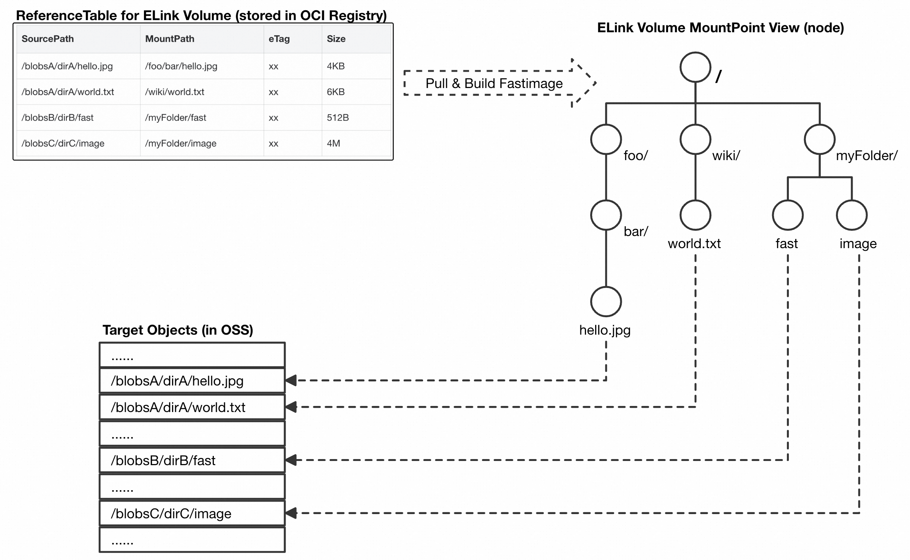
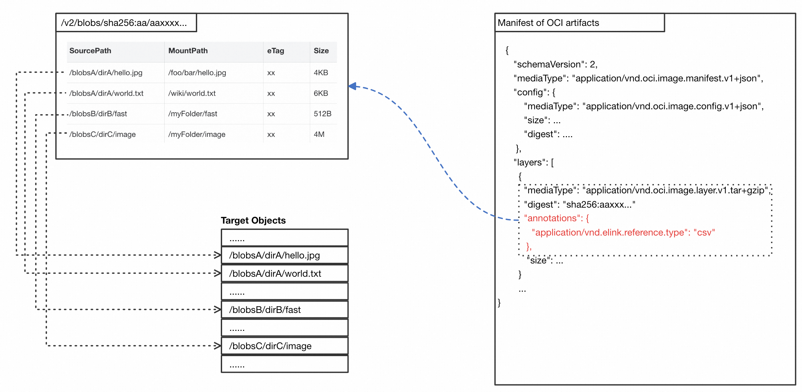

# POC: ELinkVolume 

# Background

In AI/ML scenarios, vast amounts of data in object storage need to be processed and accessed. Protecting these datasets and models from overwriting and accidental deletion is a common challenge. To ensure stability and rollback capabilities, many companies opt for long-term data preservation, avoiding data cleanup unless absolutely necessary, which leads to significant storage costs.

The OCI distribution specification outlines methods for managing large datasets. Using OCI artifacts, a registry can track the reference count of each blob and perform garbage collection. This process allows for versioning and prevents accidental deletion and overwriting of data.

Kubernetes Image Volumes enable pods to access any OCI artifact by mounting it as a volume. However, using Image Volumes for AI and other large data scenarios presents challenges:

1. Converting billions of small files and petabytes of data into OCI artifacts is extremely time-consuming, making Image Volumes impractical for accessing such inventory data.

2. Users typically access data in object storage via FUSE mount points like S3FS, rather than waiting for an OCI image to be pulled. To maintain this experience, techniques like streaming loading are needed to bypass the image pull process.

# ELinkVolume Design

The goal of this proposal is to design a method for associating existing data with OCI artifacts, tentatively named ELink Volume, which has the following characteristics:

1.  It can associate existing data with OCI artifacts without the need for repackaging.
    
2.  It can manage the garbage collection (GC) and versioning of existing data through the distribution management mechanism of the OCI repository.
    
3.  It offers better performance than open-source FUSE solutions such as S3FS.
    

## Core Design One: Avoiding Repackaging

Seekable OCI (SOCI) optimizes the build process of stargz. Based on stargz, it can provide a Rootfs mount point for containers by simply creating an OCI image index. Essentially, it maps each file in the mount point provided by SOCI to a segment of the corresponding image layer（tar.gzip）. When people access a file in the image, the SOCI driver converts the IO request into access to a specific data segment of the original image layer.

Based on this idea, the image index can be extended: when the file objects in the SOCI mount point are no longer limited to the internal index of a single image layer but can point to the entire bucket, we can achieve access to the data in the entire Bucket.

Therefore, we can store a list of objects in a Bucket in the OCI registry in the form of an OCI artifact, indicating that the OCI artifact references the content of the objects in the list (similar to a soft link?). The ELink driver can provide a read-only mount point on the node side. All files in this mount point are mapped to different items in the file list. When an application accesses a file object in the ELink mount point, the IO request is redirected to the actual address of the referenced object.

### ELink Reference List Format

Each reference item of an OSS object in ELink should contain at least four elements:

*   SourcePath: The actual address of the object in the Bucket
    
*   MountPath: The file path to which the object is mapped in ELink
    
*   Size: The size of the object
    
*   ETag: The unique identifier of the object. When the ETag of the referenced object changes, it indicates that the object has been modified. In this case, the application IO access to the target object through ELink should be deemed invalid.
    

|  **SourcePath**  |  **MountPath**  |  **eTag**  |  **Size**  |
| --- | --- | --- | --- |
|  /blobsA/dirA/hello.jpg  |  /foo/bar/hello.jpg  |  xx  |  4KB  |
|  /blobsA/dirA/world.txt  |  /wiki/world.txt  |  xx  |  6KB  |
|  /blobsB/dirB/fast  |  /myFolder/fast  |  xx  |  512B  |
|  /blobsC/dirC/image  |  /myFolder/image  |  xx  |  4M  |

### Basic Concept of ELink

## Core Design Two: Associating Existing Data with OCI Artifacts

Tools such as ORAS can be used to directly create OCI artifacts from the reference list of ELink.

__When ELink accesses the target referenced object, it needs to obtain read-only authorization for that object.__

### Data Management and Garbage Collection

As data continues to grow, it becomes inevitable that redundant data needs to be cleaned up. Once data is associated with OCI artifacts through a 'ReferenceList', the OCI Registry can parse the contents of the 'ReferenceList' by scanning the images. This allows the system to determine which data in the entire Bucket is being referenced and which data can be safely deleted.

## Core Design Three: High-Performance Streaming Loading Capability

The files in the ELink mount point are merely references to remote objects. In theory, this mount point can provide access to a PB-level file system. Such a large image cannot be stored locally, so ELink should inherently have the capability for on-demand loading.

FUSE solutions like S3FS/Ossfs have inherent disadvantages in the performance of accessing small files. In the imageNet test set, when randomly accessing 100,000 small files of 100K each, the performance of OSSFS is less than 30MB/s.

Overlaybd provides a block device image that supports on-demand loading. This project has been widely used in Alibaba Group and DataBricks for many years, and AlibabaCloud and Azure have also productized this project.

Overlaybd-TurboOCI also provides a mechanism similar to SOCI for on-demand loading without the need for re-conversion, but it changes from FUSE mount mode to block device mount mode.

Based on overlaybd-turboOCI, we have implemented support for ELink. Under the resource constraints of 4c8g, ELink based on turboOCI achieves a throughput of nearly 800MB/s for small files of 100KB.

## Core Design Four: Extending OverlayBD Images with ELink

In AI scenarios, many users are accustomed to packaging OSS models into images. The image construction in this case requires downloading the model to a specified location, packaging it into an OCI image layer, and then uploading it, which consumes a lot of time. Similarly, even the construction or conversion of on-demand loading images cannot avoid this time-consuming process.

To address this, we provide a binary tool called ‘ELink’ that can write the reference information from a specified referenceList into an OverlayBD image, avoiding the writing of actual data.
