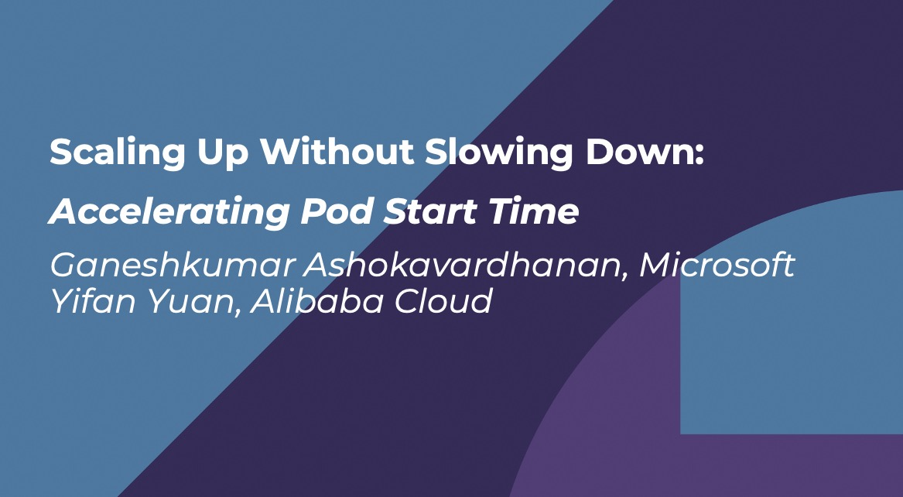
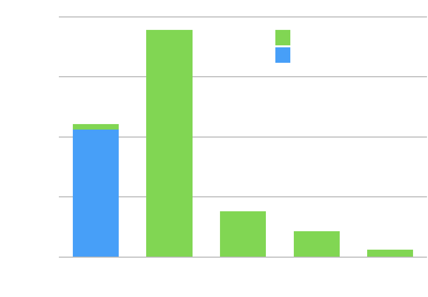
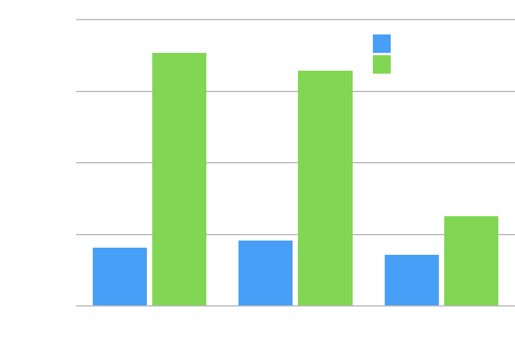
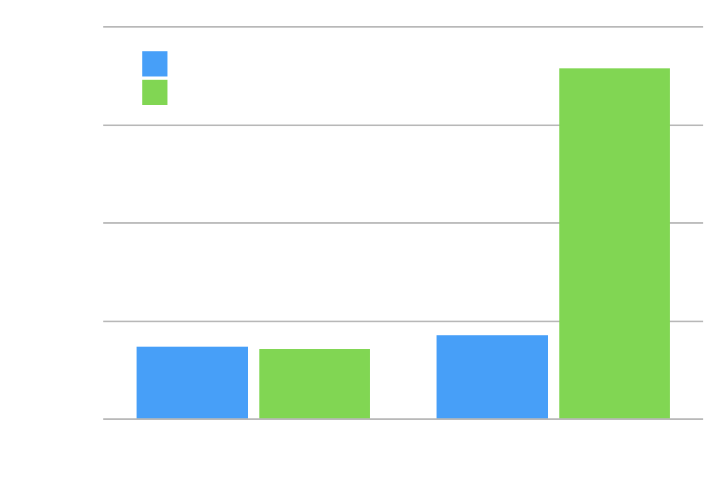
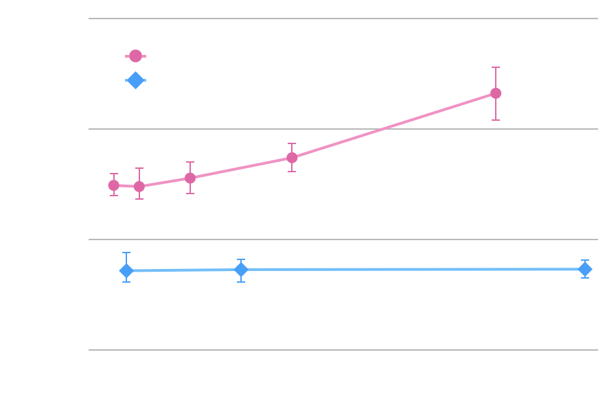
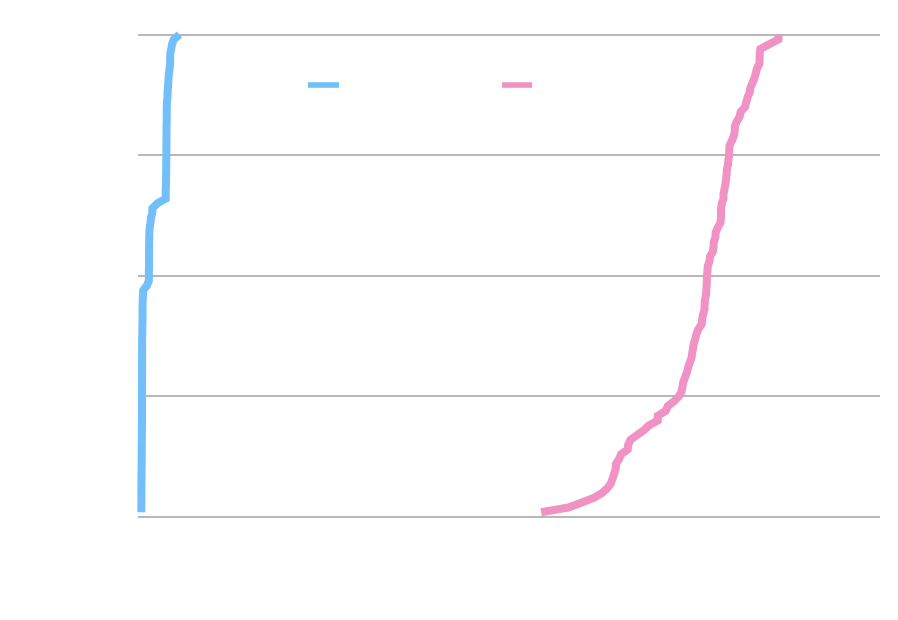
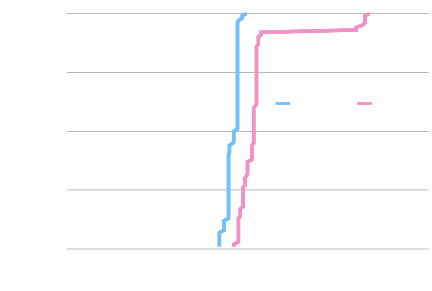

# Overlaybd

Overlaybd (overlay block device) is a novel layering block-level image format, which is design for container, secure container and applicable to virtual machine. And it is an open-source implementation of paper [DADI: Block-Level Image Service for Agile and Elastic Application Deployment. USENIX ATC'20](https://www.usenix.org/conference/atc20/presentation/li-huiba).

[Scaling up Without Slowing Down: Accelerating Pod Start Time. KubeCon+CloudNativeCon Europe 2024](https://youtu.be/RJ6Lt9bVNTw)

Overlaybd was first proposed by Alibaba Cloud and widely used in Alibaba cloud services. It became a sub-project of containerd in 2021.

As an image format, overlaybd has 2 core component:

- Overlaybd is a layering image format, provideing a merged view of a sequence of block-based layers as a virtual block device. [SPEC](https://containerd.github.io/overlaybd/#/specs/lsmt.md)

- Zfile is a compression file format which support seekalbe online decompression. [SPEC](https://containerd.github.io/overlaybd/#/specs/zfile.md)

# Components

## Overlaybd service

[GitHub](https://github.com/containerd/overlaybd)

Sub-project of containerd, contains the storage service of overlaybd image format, provideing a merged view of a sequence of block-based layers as a virtual block device.
Now this service contains an implementation of overlaybd based on [TCMU](https://www.kernel.org/doc/Documentation/target/tcmu-design.txt), and will provide an implementation based on [ublk](https://docs.kernel.org/block/ublk.html) in the future.

This service is based on [PhotonLibOS](https://github.com/alibaba/PhotonLibOS), which is a high-efficiency LibOS framework.

## Accelerated container image

[GitHub](https://github.com/containerd/accelerated-container-image)
[Getting started](https://github.com/containerd/accelerated-container-image/blob/main/docs/QUICKSTART.md)

Sub-project of containerd, which is a solution of remote container image by fetching image data on-demand without downloading and unpacking the whole image before the container starts. This repositry contains a containerd snapshotter and image conversion tools for overlaybd.

## P2P data distribution

[GitHub](https://github.com/data-accelerator/dadi-p2proxy)

Use p2p protocol to speed up HTTP file download for registry in large-scale clusters.

 

# Key features

## High Performace

Overlaybd is a block-device-based image format, which has much lower complexity than filesystem-based implementations. For example, cross-layer hardlink and non-copy commands like chown are very complex for filesystem-based image without copying up, but is natively supported by overlaybd.

## High Reliability

Overlaybd outputs virtual block devices through TCMU, which is a linux kernel module and widely supported in most operation systems.
Overlaybd backstore can recover from failures or crashes, which is difficult for FUSE-based image formats.

# Community

For sync communication catch us in the #overlaybd slack channels on Cloud Native Computing Foundation's (CNCF) slack - cloud-native.slack.com. Everyone is welcome to join and chat. [Get Invite to CNCF slack.](https://communityinviter.com/apps/cloud-native/cncf)