# Overlaybd - Instant Image Pulling, No More Waiting

A fast, secure, stable, universal, proven, open-source image solution for all forms of
containers, virtual machines, and sandboxes.

# Introduction

[Overlaybd (overlay block device)](https://github.com/containerd/overlaybd)
is a novel layered image format based on block-diff representation.
It is designed for fast launching of containers (as well as secure containers).
Born in Alibaba, overlaybd is deployed at **scale** for **years** in its production environment,
exclusively supporting all its own applications, such as Taobao (淘宝), TMall (天猫), AlibabaCloud (阿里云), etc.
Overlaybd is also commercialized in AlibabaCloud as the single option for container image
acceleration, and has been adopted by many major customers of AlibabaCloud across the globe.
Overlaybd is an open-source sub-project of containerd, the industry-standard container runtime
[graduated at CNCF](https://www.cncf.io/projects/containerd/).
The project has been integrated by many organizations world-wide, most notably
[Azure Kubernetes Service's Artifact Streaming](https://learn.microsoft.com/en-us/azure/aks/artifact-streaming-overview),
[Colab (from Google)](https://medium.com/@gogasca_/using-overlaybd-to-improve-startup-time-6c5f90f23345),
[Databricks](https://www.databricks.com/blog/booting-databricks-vms-7x-faster-serverless-compute) +
[Superhuman](https://www.databricks.com/blog/how-superhuman-and-databricks-built-200k-qps-inference-platform-together),
[DeepSeek Elastic Compute (DSes)](https://arxiv.org/html/2606.19348v1),
[Flatcar Container Linux](https://www.flatcar.org/docs/latest/os-config/network/overlaybd-artifact-streaming/),
[fly.io](https://community.fly.io/t/experimental-speedy-machine-creation-with-overlaybd/18958),
[hocus.dev](https://hocus.dev/blog/virtualizing-development-environments),
[Kimi AgentEnv](https://kvcache.ai/blog/agentenv-open-sourced/),
etc. Overlaybd can also be used for virtual machines or micro sandboxes.

<!-- Boss直聘, -->

Overlaybd is the official open-sourced implementation of
two papers published in USENIX Annual Technical Conference:
[DADI](https://www.usenix.org/conference/atc20/presentation/li-huiba) and
[FaaSNet](https://www.usenix.org/conference/atc21/presentation/wang-ao).
The first paper describes the general idea of overlaybd and how it
supports the large-scale infrastructure of Alibaba. And the second one
describes how overlaybd is applied (and fine-tuned) in the Function Compute
service of AlibabaCloud.

## Fast

Overlaybd achieves fast container startup through the following key designs:

- **On-demand (lazy) fetching**: Containers start immediately by reading image data remotely as needed,
  without downloading and unpacking the entire image. A 1GB+ image can launch in under 1 second.
  With proper caching / P2P transferring, overlaybd can support [launching 10,000s of containers
  within seconds](dadi-aliyun-2020-en.md).

- **Prefetching**: On-demand fetching can be combined with prefetching to warm up data
  before it is needed. Two modes are supported:
  - *Trace-based*: record the block access pattern of a prior run and replay it to
    prefetch the same blocks ahead of the next launch.
  - *File-list-based*: given a list of files required at startup, prefetch the blocks
    backing those files in advance.

- **Optimized LBA lookup**: Overlaybd operates at the block level with a flat LBA address space, so
  cross-layer lookup is a **single** index query regardless of layer count, whereas filesystem-based
  stacking (e.g. overlayfs) requires an *O(n)* lookup across layers on every path resolution, where
  *n* is the number of layers — checking each layer's directory entries sequentially.
  Furthermore, overlaybd's multi-layer block mapping uses a highly optimized linearized B+ tree
  with AVX-512 SIMD batch comparison, achieving 100s of millions of QPS on a single CPU core,
  up to 10X over conventional approaches.
  See [this](lsmt_lookup.md) for details.
  Note that this algorithm is so fast that it is [even feasible for IP address lookup in
  backbone core routers](https://www.usenix.org/conference/nsdi26/presentation/zhang-zhihao).

- **Metadata efficiency**: Operations like hardlink, chown, etc. are supported as usual
  without copy-up. Actually writes to overlaybd are pure writes - no lower-layer data
  is ever copied on write. ~~CoW~~

- **Seekable compression (ZFile)**: Random reads decompress only the requested data range,
  not the entire compressed block. Because compressed data is smaller, the actual I/O
  transfer is reduced enough that compressed random reads are often *faster* than
  uncompressed ones — the decompression cost is less than the I/O saved.

- **Benchmark results**:

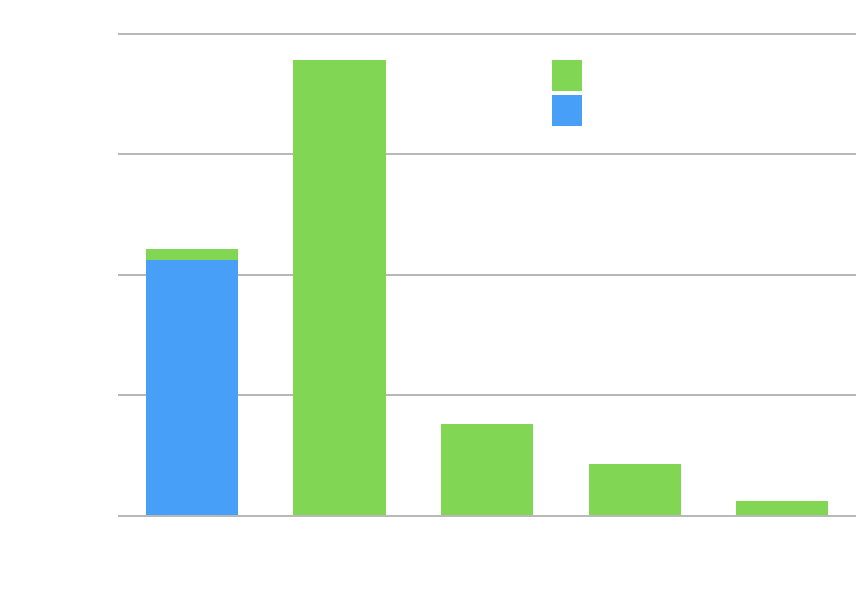
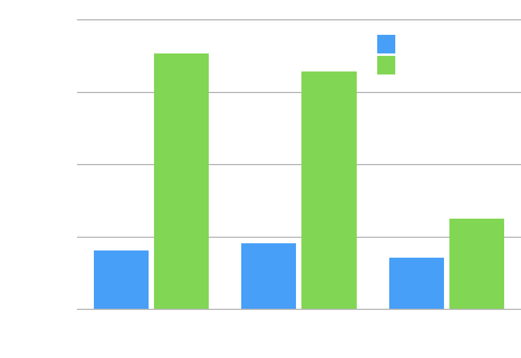
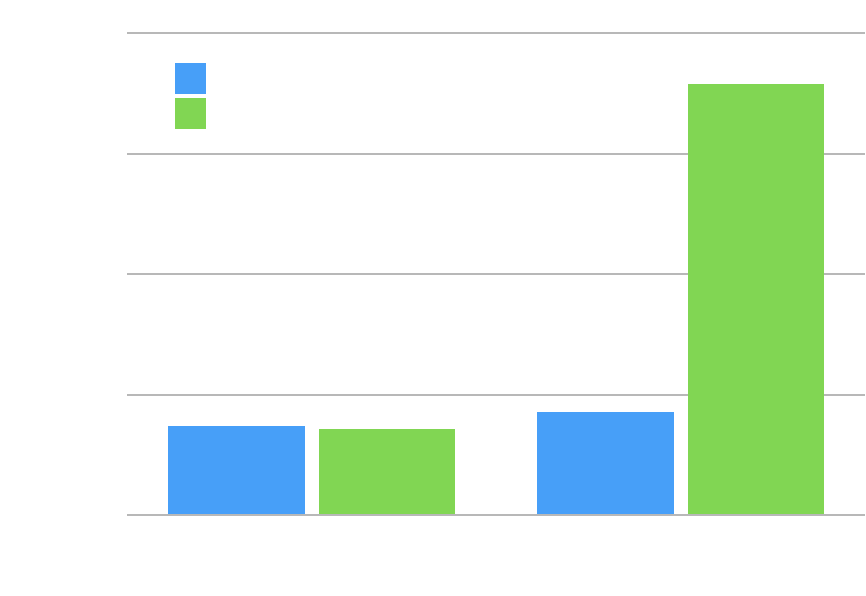
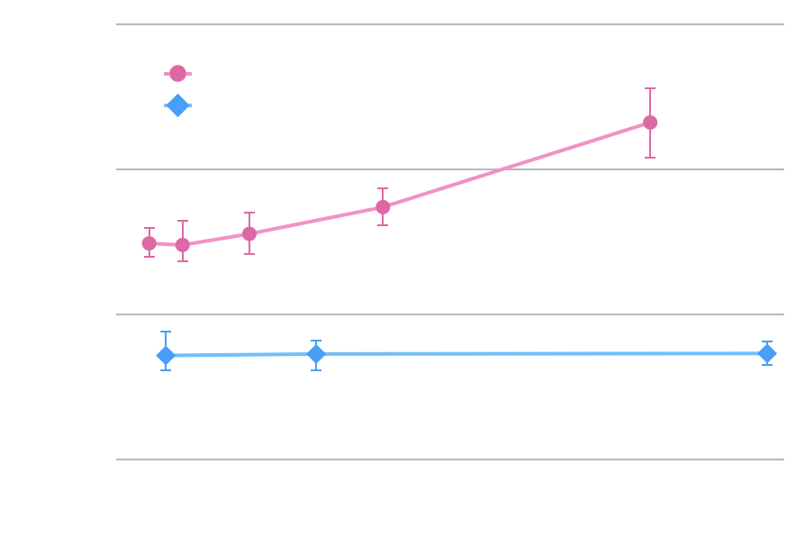
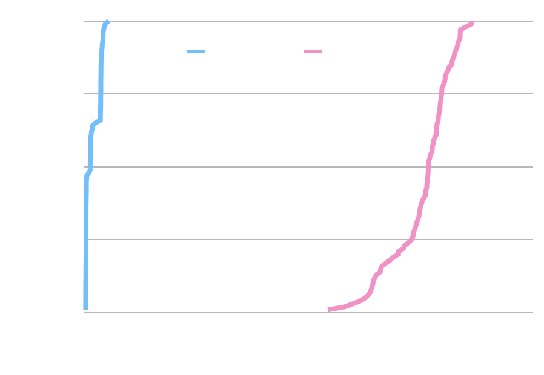
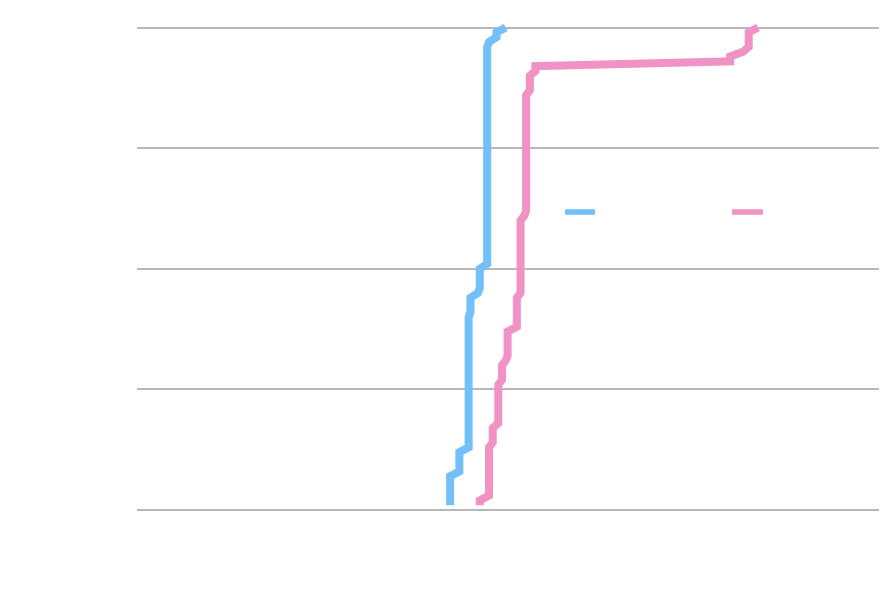

## Secure

Overlaybd exposes a virtual block device to the system, which is a well-understood interface
that keeps the attack surface minimal:

- **Block-device interface**:
  The block I/O interface is one of the oldest and most battle-tested
  boundaries in computing — hardened by decades of use in the virtual machine ecosystem
  (QEMU/KVM, virtio-blk). Filesystem-semantics image formats must serve files through
  extra translation layers — FUSE, virtio-fs, or fscache — each adding its own
  userspace/kernel interface and attack surface. Overlaybd delegates all filesystem logic
  to the kernel's native, thoroughly audited filesystem stack.

- **No filesystem parsing in userspace**: Filesystem-based image formats must implement
  tar extraction, permission handling, and metadata reconciliation in userspace — a large
  and complex attack surface. Overlaybd's userspace component only maps LBAs to data
  ranges; it never interprets filesystem structures.

- **Simple data path**: The read path is a straightforward index lookup followed by a data
  fetch. There is no code execution, no archive extraction, and no dynamic linking of
  untrusted content during image loading.

- **Sound resource isolation**: Filesystem-sharing mechanisms (virtio-fs / virtio-9p) have
  been shown to let containers bypass memory cgroup and ephemeral storage limits, because
  page population and file backing happen outside the sandbox
  ([kata-containers#12203](https://github.com/kata-containers/kata-containers/issues/12203)).
  This is a class of issue that does not exist for block-device-based images.

## Stable

Overlaybd is built on mature, production-hardened foundations:

- **Kernel-backed device interface**: Virtual block devices are exported through
  [TCMU](https://www.kernel.org/doc/Documentation/target/tcmu-design.txt) (with
  [ublk](https://docs.kernel.org/block/ublk.html) support planned), both of which are
  in-kernel frameworks maintained by the Linux community and widely deployed in storage
  stacks such as LIO and Ceph. The interface is stable across kernel versions and
  distributions.

- **Crash and failure recovery**: Because overlaybd's state lives in a thin, well-defined
  interface and on-disk format, the service can recover from process crashes or
  restarts and re-attach the device. FUSE-based formats keep filesystem state in a
  userspace daemon — if it dies, the mounted filesystem typically hangs or becomes
  unusable, and recovery is difficult.

- **Simple implementation, easier correctness**: Overlaybd's core logic is a thin LBA-to-data
  mapping over a straightforward on-disk format — far simpler than a full filesystem implementation.
  Less code and fewer invariants mean correctness is easier to achieve and verify, and the
  kernel block layer adds request queuing, retries, and error handling for free.

## Universal

A block device is the most universal storage abstraction in computing, so overlaybd works
across the full spectrum of workloads without per-runtime adaptation:

- **One format, every consumer**: Anything that can attach a block device can use
  overlaybd — containers (via a containerd snapshotter, and potentially Windows
  containers), virtual machines (QEMU/KVM, Firecracker), and micro-sandboxes alike. No
  runtime-specific image variant is needed.

- **Decoupled from filesystem choice**: Because overlaybd sits *below* the filesystem,
  the guest or host is free to run any filesystem on top — ext4, XFS, Btrfs, EROFS, and
  so on. Filesystem-based image formats, by contrast, bake a specific layout into the
  image and tie you to its semantics.

- **OS-agnostic guests**: Sandboxes and VMs increasingly run diverse operating systems —
  Linux, Windows, Android, macOS, and more. A block device is understood by all of them,
  so the same overlaybd image mechanism serves any guest OS. Linux-centric filesystem
  formats (overlayfs, EROFS, FUSE) simply cannot address non-Linux guests.

- **No special guest support**: A VM or sandbox needs only a standard block-device driver
  (virtio-blk, etc.) to consume an overlaybd image. There is no requirement to install a
  custom agent, FUSE daemon, or filesystem module inside the guest.

## Proven

Overlaybd is not a research prototype — it runs some of the largest container fleets in
the world:

- **Production in Alibaba at scale**: Deployed for years across Alibaba's entire application
  portfolio — Taobao, TMall, AlibabaCloud and more — and commercialized on AlibabaCloud as
  its container image acceleration offering, adopted by major customers worldwide.

- **Adopted across the industry**: Integrated by organizations including (but not limited to)
  [Azure Kubernetes Service (Artifact Streaming)](https://learn.microsoft.com/en-us/azure/aks/artifact-streaming-overview),
  [Databricks](https://www.databricks.com/blog/booting-databricks-vms-7x-faster-serverless-compute),
  [DeepSeek Elastic Compute](https://arxiv.org/html/2606.19348v1),
  [Flatcar Container Linux](https://www.flatcar.org/docs/latest/os-config/network/overlaybd-artifact-streaming/),
  [fly.io](https://community.fly.io/t/experimental-speedy-machine-creation-with-overlaybd/18958),
  [hocus.dev](https://hocus.dev/blog/virtualizing-development-environments),
  etc.

- **Peer-reviewed research**: The design is documented in two USENIX Annual Technical
  Conference papers — [DADI](https://www.usenix.org/conference/atc20/presentation/li-huiba)
  and [FaaSNet](https://www.usenix.org/conference/atc21/presentation/wang-ao).

## Open-source

Overlaybd is an open-source sub-project of [containerd](https://www.cncf.io/projects/containerd/)
(a CNCF graduated project) since 2021, released under the Apache-2.0 license.

- **Source code repositories on GitHub**:
  - Data I/O path: [containerd/overlaybd](https://github.com/containerd/overlaybd)
  - Snapshotter & conversion tools: [containerd/accelerated-container-image](https://github.com/containerd/accelerated-container-image)
  - P2P distribution: [data-accelerator/dadi-p2proxy](https://github.com/data-accelerator/dadi-p2proxy)

- **Neutral governance**: Originally proposed by Alibaba Cloud, it is
  maintained in the open rather than controlled by a single vendor.

- **Active, broadening community**: Beyond the core maintainers, the project receives
  contributions and feedback from across the industry — distribution packagers (Gentoo),
  cloud providers (Azure Linux / Ubuntu targets), users at organizations such as
  Databricks, and members of the EROFS, kernel, and containerd communities.

- **Open specifications**: The image format is fully documented and open for independent
  implementation:
  [LSMT](https://containerd.github.io/overlaybd/#/specs/lsmt.md),
  [ZFile](https://containerd.github.io/overlaybd/#/specs/zfile.md).
  Actually we already see several re-implementations of overlaybd / zfile, such as
  [AgentEnv](https://github.com/kvcache-ai/AgentENV/tree/main/storage/overlaybd/src).

- **Join the discussion**: For synchronous communication, catch us in the `#overlaybd`
  channel on the [CNCF slack](https://cloud-native.slack.com) (cloud-native.slack.com).
  Everyone is welcome to join and chat.
  [Get an invite to the CNCF slack.](https://communityinviter.com/apps/cloud-native/cncf)
  DingTalk Group: 186405011387.

# Why Overlaybd

## for Containers

Container platforms benefit from low cold-start latency, efficient
resource usage at high density, OCI-compatible layered distribution,
and consistent image delivery across runc and VM-based
secure-container runtimes.

The conventional OCI image stack is mature and works well for
general-purpose containers. However, for large images and bursty
scale-out workloads, downloading, decompressing, and unpacking the
entire image can become a significant part of startup latency.
VM-isolated containers also require an efficient way to expose image
data across the VM boundary.

OverlayBD complements the existing container filesystem stack with an
OCI-compatible, layered block image that supports on-demand loading and
seekable compression. It is designed to reduce image download and
startup costs while providing a block-device-based image path for both
runc and VM-based secure containers. OverlayBD has been deployed at
scale in production container platforms.

Read the full article: [Why Containers and Secure Containers Should Use Overlaybd Images](ctimg.md)

## for Agent Sandbox

Agent-sandbox platforms often require low-latency environment startup,
efficient creation from shared base images, strong isolation, high
concurrency, and support for different guest operating systems. Meeting
these requirements involves the runtime, virtualization, and image
storage layers together.

OverlayBD provides an OCI-compatible, layered block-image substrate with
on-demand loading, seekable compression, and writable layers. It is
designed to reduce image transfer and startup costs, support efficient
*compute-side* snapshot and clone workflows with a *writable* block-device
data path for VM-based sandboxes. Separate OS-specific images can use the
same OverlayBD format and OCI distribution pipeline. OverlayBD is already
used by agent-sandbox systems in production.

Read the full article: [Why Agent Sandboxes Should Use Overlaybd](sbimg.md)

## for Virtual Machines

VM platforms need fast boot from shared base images, low per-VM
metadata memory at high density, cheap snapshot and clone, and
registry-style layered distribution.

The incumbent VM disk formats — qcow2, VHD/VHDX, and VMDK — all rely
on per-file allocation tables chained one file per snapshot. Reads
walk the chain, per-file index caches multiply with chain depth, and write
cost is set by a fixed cluster size that trades directly against
index size.

OverlayBD replaces the per-file tables with a single merged,
extent-based index per device: O(1) lookup at any chain depth, an
index small enough to stay memory-resident regardless of snapshot
count, and 512-byte-granularity writes with no copy-on-write. Its
image layout follows the OCI image spec — a base image is stored
once, shared by every derivative VM, and distributed through the
existing registry ecosystem.

Read the full article: [Why Virtual Machines Should Use Overlaybd Images](vmimg.md)

# Components

## Overlaybd service

[GitHub](https://github.com/containerd/overlaybd)

Sub-project of containerd, contains the storage service of overlaybd image format, providing a merged view of a sequence of block-based layers as a virtual block device.
Now this service contains an implementation of overlaybd based on [TCMU](https://www.kernel.org/doc/Documentation/target/tcmu-design.txt), and will provide an implementation based on [ublk](https://docs.kernel.org/block/ublk.html) in the future.

This service is based on [PhotonLibOS](https://github.com/alibaba/PhotonLibOS), which is a high-efficiency LibOS framework.

The LBA lookup algorithm employs a linearized B+ tree and AVX-512 to optimize performance, significantly accelerating search speed up to 10X. [Lookup Performance](https://github.com/containerd/overlaybd/blob/main/docs/lsmt_lookup.md)

## Accelerated container image

[GitHub](https://github.com/containerd/accelerated-container-image)
[Getting started](https://github.com/containerd/accelerated-container-image/blob/main/docs/QUICKSTART.md)

Sub-project of containerd, which is a solution for remote container images by fetching image data on-demand without downloading and unpacking the whole image before the container starts. This repository contains a containerd snapshotter and image conversion tools for overlaybd.

## P2P data distribution

[GitHub](https://github.com/data-accelerator/dadi-p2proxy)

Uses the P2P protocol to speed up HTTP file download for registry in large-scale clusters.

# Events

## Artifact Streaming GA for Microsoft Azure Kubernetes Service (AKS)
It provides customers the ability to accelerate containerized workloads in
the cloud by dramatically reducing the overall startup time with *overlaybd*
image format. It is now GA since Jul 14, 2026.
See [#3928](https://github.com/Azure/AKS/issues/3928#issuecomment-4969059980) for details.

## Presentation at KubeCon + CloudNativeCon Europe 2025

*Streamlined Efficiency: Unshackling Kubernetes Image Volumes for Rapid AI Model and Dataset Loading*.
Jointly given by Microsoft Azure and Alibaba Cloud.

  <iframe style="position:absolute;inset:0;width:100%;height:100%;margin:0;border:0" src="https://www.youtube.com/embed/nHGzMmstR0E?si=qJ6yd8bN4ZeZttj-" title="YouTube video player" frameborder="0" allow="accelerometer; autoplay; clipboard-write; encrypted-media; gyroscope; picture-in-picture; web-share" referrerpolicy="strict-origin-when-cross-origin" allowfullscreen></iframe>

## Presentation at KubeCon + CloudNativeCon Europe 2024
*Scaling up Without Slowing Down: Accelerating Pod Start Time*.
Jointly given by Microsoft Azure and Alibaba Cloud.

  <iframe style="position:absolute;inset:0;width:100%;height:100%;margin:0;border:0" src="https://www.youtube.com/embed/RJ6Lt9bVNTw?si=o3pP42xwT5CzdqiP" title="YouTube video player" frameborder="0" allow="accelerometer; autoplay; clipboard-write; encrypted-media; gyroscope; picture-in-picture; web-share" referrerpolicy="strict-origin-when-cross-origin" allowfullscreen></iframe>

# Who Uses Overlaybd

<!-- <a href="https://www.bmw.com" target="_blank">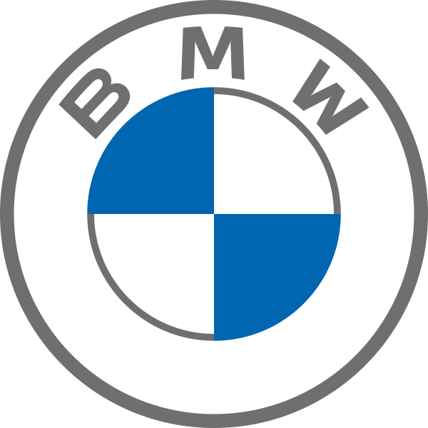</a> -->
<!-- <a href="https://www.byd.com" target="_blank">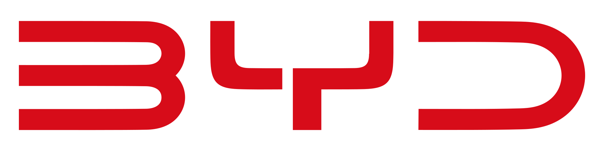</a> -->

<!-- <a href="https://www.dewu.com" target="_blank">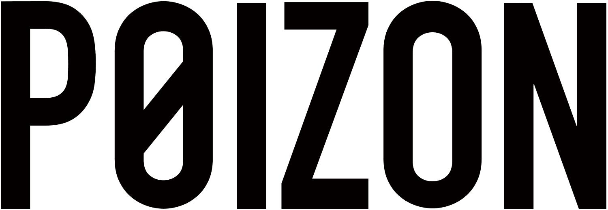</a> -->

<a href="https://www.kimi.com" target="_blank">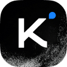</a>

<!--  -->
<!--  -->
<!--  -->
<!-- <a href="https://www.recruit.co.jp" target="_blank">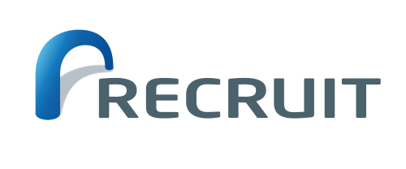</a> -->
<!-- <a href="https://www.sinopec.com" target="_blank">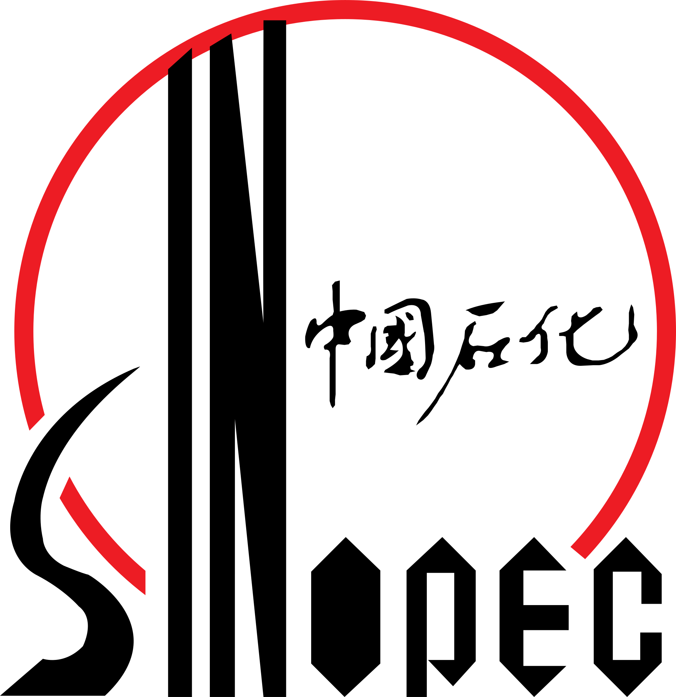</a> -->

<!--  -->
<!--  -->

*The list above is by no means exhaustive — many more organizations are running overlaybd in production.*
