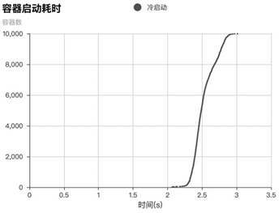
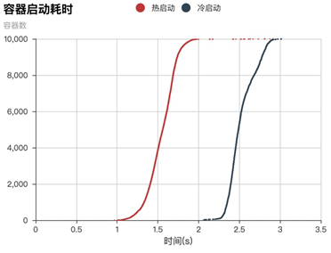
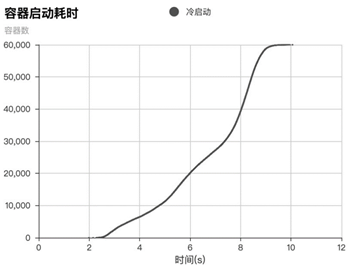
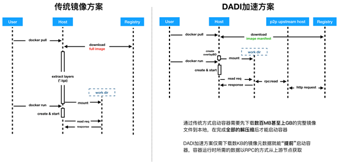
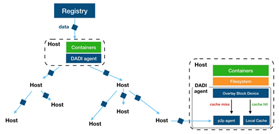

# Launching 10,000 Containers in Seconds: Inside Alibaba Cloud's Container Image Acceleration

> Author: Mu Huan | Published: 2020-01-08
> Source: https://developer.aliyun.com/article/742103

## Introduction

Alibaba Cloud's container and storage teams collaborated to leverage the **DADI accelerator**, enabling on-demand image reading and P2P distribution. The result: **10,000 containers launched in 3.01 seconds**, completely eliminating the minutes-long cold start wait and the network congestion caused by massive parallel image distribution from registries.

## Background and Pain Points

When handling traffic spikes from events like shopping festivals, flash sales, and live streaming, containers must scale up within an extremely short time window.

- **Warm start**: With a local image cache, instantiation is very fast.
- **Cold start pain**: Without a local image, the full image must be downloaded and decompressed from the registry (constrained by network and disk performance), taking minutes. Large-scale batch cold starts can even render the registry unresponsive due to network congestion.
- **Data redundancy**: A full container image is often hundreds of MB or even GBs, yet the data actually needed for startup may be a tiny fraction (e.g., a test image of 894MB required only 15MB to start — about 1.6%).

## Test Scenario and Results

Tests were conducted on Alibaba Cloud Container Service for Kubernetes (ACK), using a cluster of **1,000 nodes with 4 cores and 8GB RAM each**.

- **10,000-container launch**: Starting 10,000 containers took only **3.01 seconds** (p999 latency: 2.97s).

- **Cold vs. warm start**: Warm start took 2.91s (p999: 2.56s). DADI cold start, fetching data on-demand from the P2P network, reduced disk I/O pressure and produced fewer long-tail containers.

- **Time-limited stress test**: Within a 10-second window, **59,997 containers** were launched across 1,000 hosts (the 60,000th container started at 10.06s).

## Core Technology: The DADI Accelerator

The DADI accelerator bypasses the traditional "download image → decompress image → start container" pipeline. Its core principle is "on-demand reading," achieved through three key optimizations:

1. **Image format optimization**: A new image format with a built-in index allows direct access to required data without downloading or decompressing the entire image.
2. **On-demand P2P data fetching**: A tree-structured P2P network distributes data. A small number of P2P root nodes fetch from the registry, while other host nodes transfer data among themselves, greatly reducing single-point registry load and network congestion.

3. **Efficient decompression**: A new compression file format enables on-demand decompression of only the data actually accessed, with decompression overhead that is nearly negligible.

**How it works**:

> When launching a container with DADI, only a few KB of image metadata is downloaded from the registry. A virtual device — the **Overlay Block Device** — is created and mounted to the container's working directory. The Docker engine considers the image fully loaded. The actual image data needed at runtime is then fetched on-demand from the local cache or upstream nodes in the P2P network.

## Conclusion

The deep integration of Alibaba Cloud ACK and DADI achieved launching tens of thousands of containers in seconds, gracefully handling large-scale application scaling and deployments. This technology will also serve as a key enabler for **serverless container** startup acceleration in the future.
