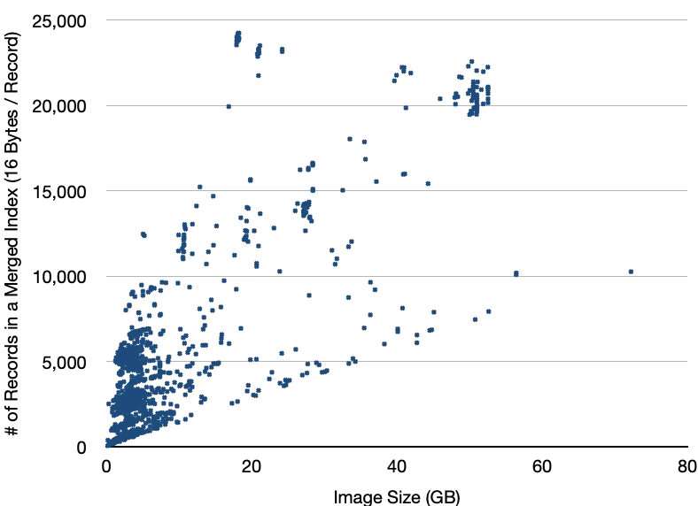

# Why Agent Sandboxes Should Use Overlaybd Images

Agent sandboxes — the execution environments behind Code Interpreters,
computer-use agents, and autonomous coding tools — impose a unique
combination of requirements on their image infrastructure: sub-second
cold starts, strong security isolation, cheap snapshotting, massive
concurrency, and OS heterogeneity. No single traditional image format
satisfies all of these simultaneously. This article argues that
[overlaybd](https://github.com/containerd/overlaybd) — a layered,
lazily-loaded, seekably-compressed block-device image format — is the
best architectural fit for this workload.

## What Makes Agent Sandboxes Different

An agent sandbox is not a conventional CI runner or a long-lived VM.
Its workload profile has four distinguishing characteristics:

1. **OS heterogeneity.** Agents increasingly need Windows desktops,
   Android emulators, or macOS environments — not just Linux containers.

2. **Exploratory, interactive execution.** A user sends a prompt and
   expects a working environment in under a second. The agent then tries
   things, fails, and retries — the platform must support cheap
   snapshot-and-fork (or rollback) so that each speculative branch costs
   nearly nothing and resumes instantly.

3. **Untrusted code execution.** The agent runs arbitrary, potentially
   adversarial code. The sandbox boundary is a security perimeter, not
   merely a resource-management convenience.

4. **Massive concurrency.** A single platform may run thousands of
   sandboxes simultaneously, all booting from the same base image and
   competing for host memory, network bandwidth, and storage I/O.

Each of these properties, taken alone, can be addressed by existing
technology. Taken together, they rule out most conventional approaches.

## Why Traditional Formats Fall Short

### Multi-OS support

Filesystem-sharing mechanisms (virtio-fs, 9p, fscache, etc.) assume a Linux
guest with a compatible kernel; they cannot serve a Windows or Android
guest without a completely different data path.
Any image format that requires a specific guest kernel module or
assumes Linux-specific serving infrastructure is disqualified as a
universal substrate from the start.

The service framework of agent sandboxes needs a single stack that
is independent of and supports all possible guest OSes.

### VM snapshot: save and cross-machine restore

Agent sandboxes are frequently snapshotted, cloned, rolled back, and
resumed, sometimes on a different physical host — and because agents
explore interactively (fork on every speculative branch, roll back on
failure, resume instantly), snapshots are not a rare administrative
operation but a per-action hot path. The storage layer should thus
make writable state easy to capture and minimize host-local
dependencies.

Storage paths that maintain guest-host session state require additional
coordination among the runtime, VMM, and host-side storage service during
snapshot and restore. Cross-host restoration also requires the destination
to access the immutable base image and the sandbox's writable state.

Block-image services are stateless — they don't have any state shared
with the guest clients, and every request carries all information needed
to serve it. This is a key feature that makes it easy to do guest
checkpointing, restoring, cross-host cloning, or migration.

### Security

Sandboxes execute untrusted, potentially adversarial code. The storage
interface is part of the security boundary.

Filesystem-level formats parse complex metadata (xattrs, ACLs, symlinks,
device nodes) in the host or hypervisor context, exposing a large
kernel/userspace attack surface to untrusted guest content. Real
vulnerabilities exist:
[Kata Containers #12203](https://github.com/kata-containers/kata-containers/issues/12203)
showed that virtio-fs and 9p shared-filesystem setups allow guests to
bypass memory-cgroup and ephemeral-storage accounting entirely, because
the host kernel's first-touch page accounting does not attribute pages
to the guest cgroup.

### Efficiency

Even where traditional formats are functionally usable, their efficiency
is poorly matched to sandbox workloads. Thousands of concurrent
instances amplify every inefficiency:

- **O(n) lookup cost with layer depth.** overlayfs resolves each file
  access (open, stat, readdir, etc.) by searching
  every layer's directory tree top-down — O(n) in
  the number of layers. EROFS is a single-layer read-only filesystem,
  so a multi-layer image built from EROFS normally stacks mounts with
  overlayfs and inherits the same O(n) walk. (EROFS's own answer — a
  pre-built merged view flattened onto a single block device for VM
  pass-through — avoids stacking only by adopting the block-device
  route itself, and stays read-only.) qcow2's native internal
  snapshots avoid this
  (all data lives in one file), but to conform to the layered-image
  model that container ecosystems expect (one image file per layer,
  shared and composable), operators must instead chain separate qcow2
  files via backing files. In that pattern, a read miss walks the chain
  downward until it finds the data — again O(n). Agent sandboxes
  accumulate dozens of layers (incremental package installs, one
  snapshot per speculative branch), so every random read pays an
  ever-growing penalty.

- **Index memory at density (qcow2).** qcow2 uses a two-level L1/L2
  mapping table to locate each 64 KB cluster. For a 100 GB image this
  table is ~12.5 MB, yet QEMU's default L2 cache is only 1 MB —
  covering roughly 8% of the table. Random I/O therefore triggers
  frequent L2 page eviction and reload. The operator faces a dilemma:
  raise the per-VM cache to the full 12.5 MB and hundreds of VMs consume
  gigabytes of host memory in metadata alone, or keep the default and
  accept constant cache misses on every I/O path.

- **Cold-start latency (OCI tar + gzip).** The standard container image
  requires downloading, decompressing, and extracting every layer before
  startup — even though in practice only a small fraction of image data
  is accessed during startup. For a 4 GB sandbox image, this means
  minutes of cold-start latency. Lazy-pull solutions (eStargz, SOCI)
  mitigate this but remain bound to filesystem semantics and tar's
  structural limitations.

- **Metadata round-trip multiplier (virtio-fs).** With virtio-blk, the
  guest runs its own filesystem; path resolution, permission checks, and
  dentry lookups all complete locally, and only the final data blocks
  cross the VM boundary. virtio-fs inverts this: every metadata
  operation (lookup, getattr, open) becomes a separate FUSE round-trip
  across the VM boundary. A single open() on a nested path may incur
  five or more round-trips, each paying virtio notification and context-
  switch latency. The operations themselves are cheap; the cost is doing
  them one-at-a-time across a VM boundary instead of in-batch locally.
  RAFS served through nydusd over FUSE or virtiofs incurs the same
  per-operation round-trips.

- **Copy-on-write penalty (overlayfs, qcow2).** The first modification
  to data residing in a lower layer triggers a full copy before the
  write can proceed — overlayfs copies the entire file to the upper
  layer; qcow2 allocates a new cluster and copies the original content;
  and EROFS, being read-only, places writes in an overlayfs upper layer
  and incurs the same file-level copy-up.
  Agents frequently edit existing files (source code, configs), so this
  is a recurring cost: the copy plus the write itself.

## How Overlaybd Meets Each Need

Overlaybd presents each image as a virtual block device backed by a
stack of layers. The guest OS sees a normal disk; the host serves data
on demand.

### Multi-OS support

A block device is the one storage interface that every operating system
supports natively. Linux, Windows, Android, macOS — all boot from disks.
An overlaybd image can back any of these guests without modification: no
guest agent, no special kernel module, no filesystem-sharing daemon. One
format serves every sandbox flavor, and the filesystem inside remains a
free choice — ext4, EROFS, NTFS, whatever the guest needs.

### VM snapshot: save and cross-machine restore

Overlaybd's writable layer is a thin, self-contained file. Snapshotting
a sandbox requires only a standard disk sync — no filesystem freeze, no
daemon state flush, no protocol-level quiescing: a snapshot (checkpoint)
is always restored together with the VM memory state, so only the
host-side cached data and metadata need to be synced. Restoring on a
different host requires only access to the same backing layers (shared
storage or on-demand fetch). There is no session state, no inode table,
no lock manager to replicate — the device is stateless from the guest's
perspective.

### Security

The host sees only a sequence of block reads and writes. It never parses
the guest's filesystem metadata, never interprets symlinks or xattrs,
never shares page-cache accounting with the guest. The attack surface is
the block interface itself — one of the oldest and most thoroughly
audited boundaries in computing. Combined with microVM isolation
(Firecracker, Cloud Hypervisor), this gives a clean, minimal security
perimeter.

### Efficiency

- **O(1) cross-layer lookup.** At image load time, overlaybd merges the
  indices of all layers into a single unified LSMT index. Runtime block
  lookup is constant-time regardless of layer count — a linearized B+
  tree with AVX-512 SIMD acceleration sustains [hundreds of millions of
  QPS for index resolution](lsmt_lookup.md).

- **Compact, memory-resident index.** We have collected ~10K images
  from Alibaba's production environment, and we found that images
  larger than 50 GB have an average index under 300 KB. See the
  following figure for details (16 bytes / record). This compact
  index design allows even thousands of concurrent VMs to keep their
  indices fully memory-resident with no eviction.
  

- **On-demand fetching with seekable compression.** Only accessed blocks
  are downloaded from remote storage; containers and VMs start without
  pulling the full image. Data is compressed in small, independently
  addressable units (ZFile), so a random read fetches and decompresses
  only the relevant unit — because the compressed transfer is smaller,
  end-to-end latency is frequently lower than for uncompressed reads.
  For workloads with known access patterns, trace-based or file-list-
  based prefetch warms the local cache ahead of demand, hiding network
  latency entirely.

- **Efficient concurrency.** The userspace block server is built on
  PhotonLibOS, a coroutine runtime that easily handles tens of thousands
  of concurrent I/O streams without thread-per-connection overhead.

- **No metadata round-trips.** Because the guest sees a plain block
  device (virtio-blk or ublk), it runs its own filesystem internally.
  All metadata operations — path resolution, permission checks, dentry
  lookups — complete in-guest with zero cross-VM communication. Only
  data I/O crosses the boundary, at block granularity, and the guest OS
  actively merges adjacent requests before submission, further reducing
  round-trip count.

- **Directly writable.** The writable layer is part of the format
  itself, so writes need no extra overlayfs upper stacked on top —
  unlike read-only image formats, which must add one before the first
  write. The I/O stack stays simpler and more efficient end to end.

- **No copy-on-write penalty.** The writable layer is indexed at
  sector (512-byte) granularity — the smallest unit of any block I/O
  a filesystem issues — so a write always covers whole sectors and
  never triggers a copy. Write cost is proportional to write size,
  not to the size of the file or cluster being modified.

## Production Evidence

This is not a theoretical argument. Overlaybd is deployed at scale today.

### In agent sandboxes specifically

- **[DeepSeek Elastic Compute](https://arxiv.org/html/2606.19348v1).**
  DeepSeek's agent sandbox uses overlaybd-format images for its
  execution environment.

- **[fly.io](https://fly.io) and [hocus.dev](https://hocus.dev).**
  Both use overlaybd as the backing store for their microVM-based
  sandbox products, serving developer-facing code execution
  environments.

- **[Kimi AgentEnv](https://github.com/kvcache-ai/AgentEnv)
  (kvcache.ai).** Moonshot AI's agent sandbox platform re-implemented
  the overlaybd format as its image substrate, purpose-built for AI
  agent workloads, achieving [sub-second launch latency](https://github.com/MoonshotAI/Kimi-K3/blob/main/k3_tech_report.pdf).

### In large-scale production beyond sandboxes

The same underlying technology is proven in adjacent scenarios at even
greater scale, demonstrating maturity and reliability:

- **Alibaba.** Deployed for years across Alibaba's entire
  application portfolio — Taobao, TMall, AlibabaCloud, and more — and
  commercialized on AlibabaCloud as its container image acceleration
  offering, adopted by major customers worldwide.

- **[Azure](https://learn.microsoft.com/en-us/azure/aks/artifact-streaming-overview).**
  Azure Kubernetes Service's Artifact Streaming feature is built on
  overlaybd, accelerating container startup for AKS customers.

- **[Databricks](https://www.databricks.com/blog/booting-databricks-vms-7x-faster-serverless-compute).**
  Reported 7× VM startup improvement using overlaybd-based image
  acceleration on Azure.
  [Superhuman](https://www.databricks.com/blog/how-superhuman-and-databricks-built-200k-qps-inference-platform-together)
  also adopted Databricks' infrastructure to build a 200K QPS inference
  platform.

- **Peer-reviewed research.** The
  [DADI system](https://www.usenix.org/conference/atc20/presentation/li-huiba) and
  [FaaSNet](https://www.usenix.org/conference/atc21/presentation/wang-ao)
  validate the architecture under rigorous academic review.

## Conclusion

How the mainstream image stacks compare on these four requirements:

| Image stack | Multi-OS support | VM snapshot & restore | Security | Efficiency |
| --- | --- | --- | --- | --- |
| OCI tar+gzip (overlayfs) | Linux only | overlay-mount state cannot be atomically captured or restored | serving the guest requires virtio-fs; known [virtio-fs security vulnerabilities](https://github.com/kata-containers/kata-containers/issues/12203) | full download and unpack; O(n) layer walk; copy-up |
| eStargz / SOCI | Linux only | overlay-mount and FUSE session state | FUSE snapshotter; serving the guest requires virtio-fs with the same [security vulnerabilities](https://github.com/kata-containers/kata-containers/issues/12203) | lazy pull, but stacking and copy-up remain |
| qcow2 | Linux, Windows, Android, macOS alike | stateless device; sync and restore anywhere | strong isolation with thin interface | O(n) backing chains; L2 cache trades memory against I/O; cluster CoW |
| EROFS (*with block device shells*) | Linux kernel feature | stateless device; sync and restore anywhere | strong isolation with thin interface | read-only — writes need an overlayfs upper backed by a second block device — complex stack and low I/O efficiency |
| Nydus (RAFS) | assumes a Linux fs stack | FUSE session and cache state live in nydusd | userspace daemon (nydusd); known [virtio-fs security vulnerabilities](https://github.com/kata-containers/kata-containers/issues/12203) | lazy chunks, but per-operation FUSE/virtio-fs round-trips |
| **overlaybd** | Linux, Windows, Android, macOS alike | stateless device; sync and restore anywhere | strong isolation with thin interface | on-demand fetch; O(1) lookup; small memory footprint; no copy-up |

Agent sandboxes need to start fast, isolate untrusted code, fork cheaply,
scale to thousands of instances, and support diverse operating systems.
These requirements, taken together, point to a single architectural
choice: a layered, lazily-loaded, seekably-compressed block-device image.

[Overlaybd](https://github.com/containerd/overlaybd) is an open-source
(Apache-2.0), CNCF-governed implementation of this design, battle-tested
in production at Alibaba Cloud, Azure, Databricks, and multiple
agent-sandbox startups. If you are building an agent sandbox and have not
yet committed to an image format, it deserves a serious look.

---

*Learn more:*
*[github.com/containerd/overlaybd](https://github.com/containerd/overlaybd) ·*
*[CNCF Slack #overlaybd](https://cloud-native.slack.com/archives/C07PCJHRZKY)*
